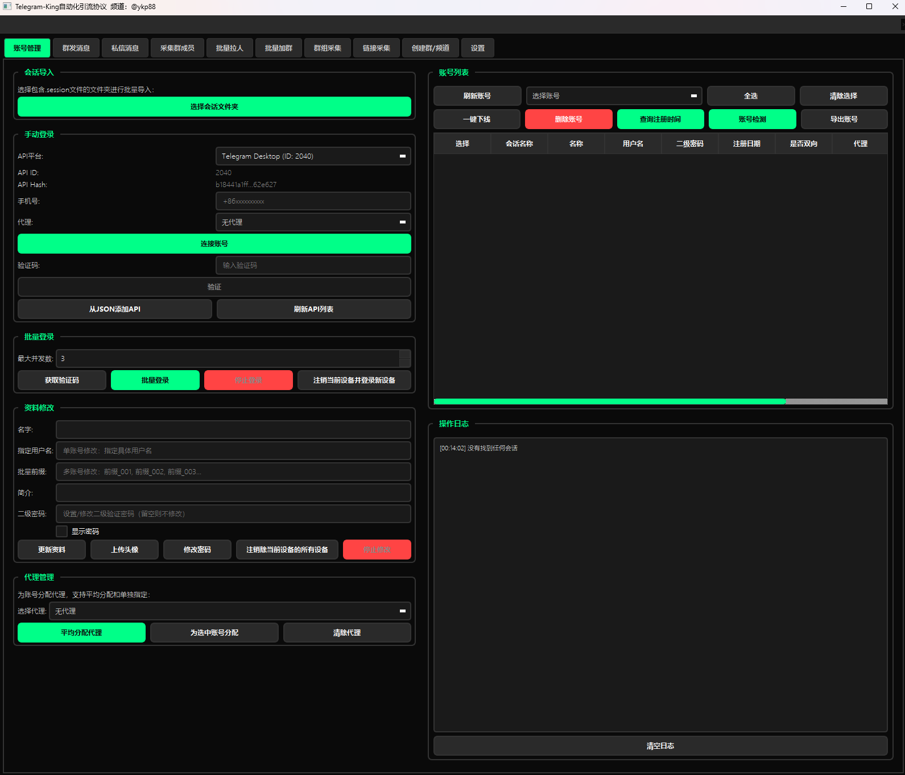
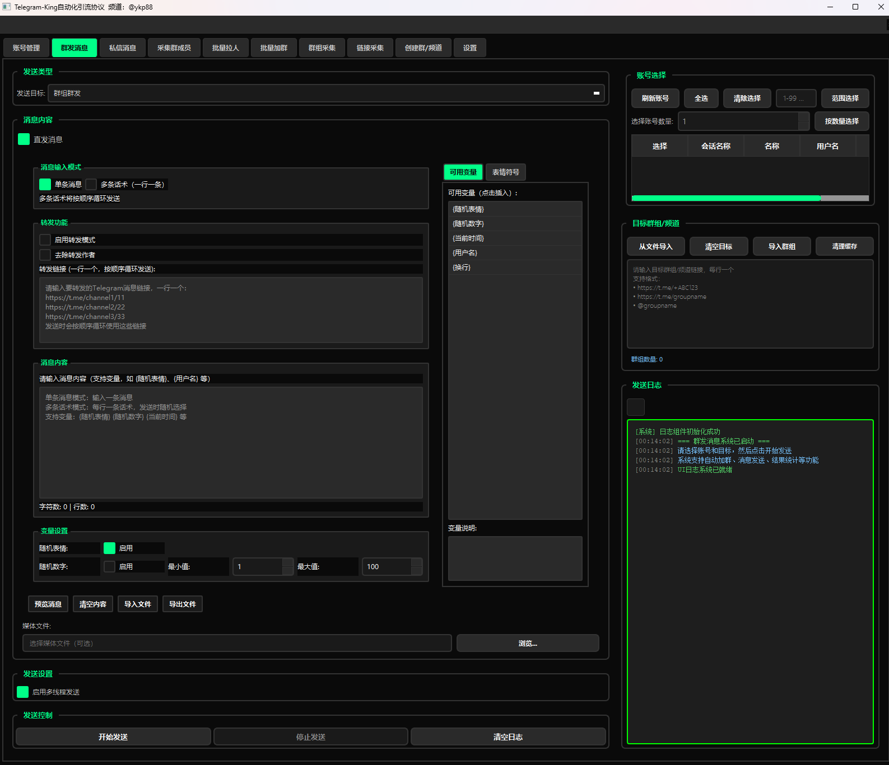
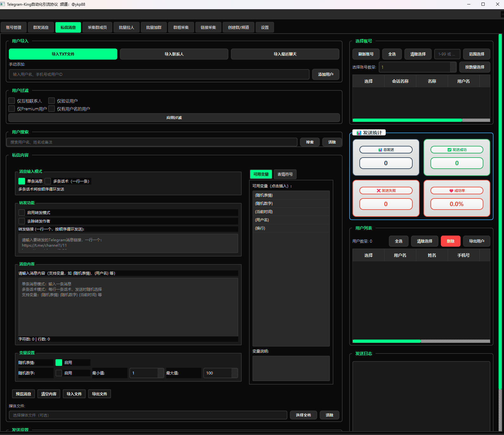
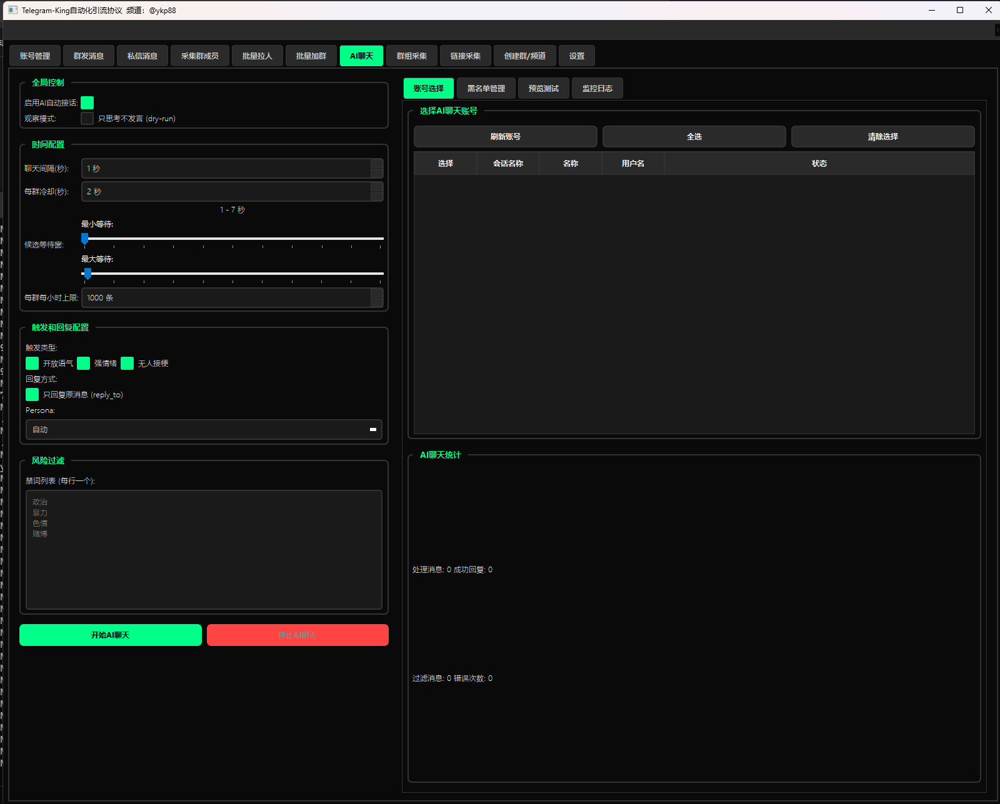

  

  # 📱 电报王 (Telegram King)

  

    <b>专业的Telegram自动化营销解决方案</b>
  

  

    <a href="https://www.cdrfc.com/">🌐 官方网站</a> •
    <a href="https://t.me/bamlp">📢 官方频道</a> •
    <a href="#功能特性">功能特性</a> •
    <a href="#软件截图">软件截图</a> •
    <a href="#常见问题">常见问题</a>
  

  

    
    
    
  

---

## 📋 目录

- [关于项目](#关于项目)
- [核心功能](#核心功能)
- [软件截图](#软件截图)
- [系统要求](#系统要求)
- [获取软件](#获取软件)
- [快速开始](#快速开始)
- [功能说明](#功能说明)
- [常见问题](#常见问题)
- [更新日志](#更新日志)
- [联系我们](#联系我们)
- [免责声明](#免责声明)

---

## 🎯 关于项目

电报王 (Telegram King) 是一款专业的Telegram自动化营销工具，采用PyQt5现代化界面设计，集成多种自动化功能，帮助企业和个人高效管理Telegram账号，实现精准营销和客户管理。

### ✨ 为什么选择我们

- 🚀 **高效自动化** - 批量操作节省90%的时间
- 🤖 **AI智能** - 集成多种AI模型，智能对话更人性化
- 🛡️ **安全稳定** - 专业的反检测机制，保护账号安全
- 💼 **专业支持** - 完善的技术支持和使用文档
- 🎨 **界面友好** - 现代化设计，操作简单直观

---

## 🌟 核心功能

### 📨 消息管理
- ✅ 批量群发消息到多个群组
- ✅ 私信批量发送（支持导入用户列表）
- ✅ 定时发送和周期性发送
- ✅ 消息模板管理（支持文本、图片、视频）
- ✅ 变量替换（姓名、昵称等个性化内容）

### 👥 群组操作
- ✅ 自动加群（支持链接和邀请）
- ✅ 批量拉人入群（多账号协同）
- ✅ 群组信息采集
- ✅ 创建和管理群组
- ✅ 群成员导出

### 🤖 AI智能聊天
- ✅ 多种AI后端支持（Hugging Face、Ollama、本地API）
- ✅ 智能触发机制（问题识别、情感分析）
- ✅ 多种对话风格（随意、幽默、专业、共情）
- ✅ 自定义人设和回复策略
- ✅ 黑名单和敏感词过滤

### 👤 账号管理
- ✅ 多账号批量管理
- ✅ 账号状态实时监控
- ✅ 自动登录和保活
- ✅ 代理配置和轮换
- ✅ 设备指纹模拟

### 🔧 高级功能
- ✅ 自动会话匹配
- ✅ 头像和资料自动设置
- ✅ 其他设备自动登出
- ✅ 密码保护管理
- ✅ 详细日志记录

---

## 📸 软件截图

  
  
<i>主界面 - 简洁现代的设计</i>

  
  
<i>账号管理 - 批量操作多个账号</i>

  
  
<i>群发消息 - 支持文本、图片、视频</i>

  
  
<i>AI聊天配置 - 多种AI模型可选</i>

---

## 💻 系统要求

### 最低配置
- **操作系统**: Windows 7 / 8 / 10 / 11 (64位)
- **内存**: 4GB RAM
- **存储空间**: 500MB 可用空间
- **网络**: 稳定的互联网连接

### 推荐配置
- **操作系统**: Windows 10 / 11 (64位)
- **内存**: 8GB RAM 或以上
- **存储空间**: 1GB 可用空间
- **网络**: 高速互联网连接
- **其他**: 配置代理服务器（可选，提高稳定性）

---

## 📦 获取软件

### 方式一：官方网站
访问我们的官方网站获取最新版本和详细文档：

🌐 **官方网站**: [点击访问](https://www.cdrfc.com/)

### 方式二：Telegram频道
加入我们的官方Telegram频道，获取最新更新和技术支持：

📢 **Telegram频道**: [@bamlp](https://t.me/bamlp)

> 💡 **提示**: 请仅从官方渠道获取软件，避免使用来源不明的版本

---

## 🚀 快速开始

### 第一步：获取软件
从官方渠道获取软件安装包

### 第二步：准备API凭证
1. 访问 [Telegram API](https://my.telegram.org/auth)
2. 登录你的Telegram账号
3. 点击 "API development tools"
4. 创建应用并获取 `api_id` 和 `api_hash`

### 第三步：配置账号
1. 启动软件，进入"账号管理"标签页
2. 点击"添加账号"，输入手机号
3. 输入收到的验证码完成登录
4. 配置代理（可选，但推荐使用）

### 第四步：开始使用
- 批量群发：进入"群发消息"标签页
- AI聊天：进入"AI聊天"标签页配置
- 拉人入群：进入"批量邀请"标签页

📖 **详细教程**: 访问官网查看完整的使用文档和视频教程

---

## 📚 功能说明

### 群发消息功能
支持向多个群组或用户批量发送消息，具有以下特点：

- **智能延迟**: 自定义发送间隔，避免触发限制
- **消息模板**: 支持变量替换，实现个性化消息
- **多媒体支持**: 文本、图片、视频、文件等
- **失败重试**: 自动重试失败的消息
- **进度监控**: 实时查看发送进度和状态

### 批量拉人功能
将用户批量邀请到指定群组：

- **多账号协同**: 使用多个账号分担任务
- **智能去重**: 自动跳过已在群组的用户
- **成功率统计**: 实时显示邀请成功率
- **异常处理**: 自动处理各种错误情况

### AI智能聊天
让你的账号具备智能对话能力：

- **自动回复**: 识别问题并自动回复
- **情感分析**: 根据对话情绪调整回复风格
- **学习能力**: 支持自定义训练数据
- **安全机制**: 敏感词过滤和黑名单保护

---

## ❓ 常见问题

<b>Q: 软件是否安全？会不会封号？</b>

A: 软件采用专业的反检测机制，模拟真实用户行为。但Telegram对自动化有一定限制，建议：
- 使用代理服务器
- 合理设置发送间隔
- 不要过度频繁操作
- 遵守Telegram使用条款

<b>Q: 是否支持多账号操作？</b>

A: 是的，软件支持无限账号管理，可以同时操作多个账号进行批量任务。

<b>Q: AI聊天需要什么配置？</b>

A: AI功能支持多种后端：
- Hugging Face (需要GPU，显存4GB+)
- Ollama (轻量级，CPU即可)
- 自定义API (对接任何AI服务)

<b>Q: 如何获取技术支持？</b>

A: 可以通过以下方式联系我们：
- 加入官方Telegram频道
- 访问官网提交工单
- 查看在线文档和视频教程

<b>Q: 软件支持哪些语言？</b>

A: 目前主要支持中文界面。

<b>Q: 是否提供试用版本？</b>

A: 请访问官方网站或联系官方频道了解试用政策。

---

## 📝 更新日志

查看 [更新日志.md](更新日志.md) 了解详细的版本更新历史。

### 最新版本亮点
- 🎉 全新的AI聊天系统
- 🚀 优化消息发送速度
- 🛡️ 增强账号安全保护
- 🎨 界面优化和性能提升

---

## 📞 联系我们

### 官方渠道

🌐 **官方网站**: [https://www.cdrfc.com/](https://www.cdrfc.com/)

📢 **Telegram频道**: [@bamlp](https://t.me/bamlp)

---

### 关注我们获取

✅ 最新版本发布通知
✅ 使用技巧和教程
✅ 功能更新预告
✅ 专属优惠活动

---

## ⚠️ 免责声明

1. **使用条款**: 本软件仅供学习和合法商业用途，使用者需遵守当地法律法规以及Telegram服务条款。

2. **责任声明**: 用户使用本软件产生的任何后果由用户自行承担，开发者不承担任何法律责任。

3. **知识产权**: 本软件为商业软件，受知识产权法保护。未经授权不得复制、分发或逆向工程。

4. **账号安全**: 虽然软件采用安全机制，但过度使用自动化功能可能违反Telegram政策，请合理使用。

5. **数据隐私**: 软件不会收集或上传用户的个人数据，所有数据均存储在本地。

---

## ⭐ 支持我们

如果这个项目对你有帮助，请给我们一个Star ⭐

**让更多人了解TG引流软件！**

---

© 2025 TG引流软件. 版权所有

